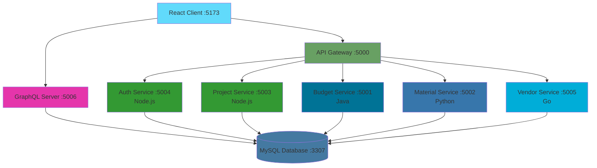

# 🏗️ BuildPro - Construction Management System

[](https://www.docker.com/)
[](https://microservices.io/)
[](LICENSE)

> **BuildPro** adalah sistem manajemen konstruksi berbasis web yang dirancang untuk mengelola proyek konstruksi, material, vendor, keuangan, dan log harian dengan arsitektur microservices.

---

## 📋 Daftar Isi

- [Tentang Proyek](#-tentang-proyek)
- [Fitur Utama](#-fitur-utama)
- [Arsitektur Sistem](#-arsitektur-sistem)
- [Tech Stack](#-tech-stack)
- [Prerequisites](#-prerequisites)
- [Instalasi](#-instalasi)
- [Menjalankan Aplikasi](#-menjalankan-aplikasi)
- [Database Setup](#-database-setup)
- [Struktur Proyek](#-struktur-proyek)
- [API Documentation](#-api-documentation)
- [Default Login](#-default-login)
- [Development Guide](#-development-guide)
- [Deployment](#-deployment)
- [Troubleshooting](#-troubleshooting)
- [Contributing](#-contributing)
- [License](#-license)

---

## 🎯 Tentang Proyek

**BuildPro** adalah platform manajemen konstruksi yang komprehensif, dibangun dengan arsitektur microservices untuk skalabilitas dan maintainability yang optimal. Sistem ini dirancang untuk membantu perusahaan konstruksi dalam:

- ✅ Mengelola multiple proyek konstruksi secara bersamaan
- ✅ Monitoring progress dengan S-Curve Chart
- ✅ Manajemen inventory material & logistik
- ✅ Tracking pembayaran termin & budget
- ✅ Integrasi vendor & supplier
- ✅ Daily logs untuk dokumentasi pekerjaan
- ✅ Multi-role user management (Admin, Worker, Logistic, Vendor)

---

## ✨ Fitur Utama

### 🏗️ **Project Management**
- Dashboard overview semua proyek
- Detail proyek dengan progress tracking
- Update progress real-time dengan S-Curve visualization
- Timeline management dan deadline tracking
- Budget planning & monitoring

### 📦 **Material & Logistics**
- Inventory management material konstruksi
- Stock tracking real-time
- Material request & approval workflow
- Purchase order automation
- Low stock alerts

### 💰 **Finance & Budget**
- Payment terms management (DP, Termin 1, Termin 2, Retensi)
- Auto-update payment status based on project progress
- Budget allocation & tracking
- Financial reports & analytics
- Export to PDF for reporting

### 🏪 **Vendor Portal**
- Vendor registration & management
- Material catalog per vendor
- Price comparison tools
- Purchase order tracking
- Vendor performance metrics

### 📝 **Daily Logs**
- Catatan harian pekerjaan lapangan
- Photo upload & documentation
- Worker attendance tracking
- Activity logs dengan timestamp
- Search & filter by date/project

### 👥 **User Management**
- Multi-role authentication (Admin, Worker, Logistic, Vendor)
- Role-based access control (RBAC)
- Secure JWT authentication
- User activity logging

---

## 🏛️ Arsitektur Sistem

BuildPro menggunakan **Microservices Architecture** dengan komponen-komponen berikut:



### 📊 Service Breakdown

| Service | Technology | Port | Responsibility |
|---------|-----------|------|----------------|
| **Client** | React + Vite + Ant Design | 5173 | Frontend UI |
| **API Gateway** | Node.js + Express | 5000 | Request routing & aggregation |
| **GraphQL Server** | Apollo Server | 5006 | Data querying layer |
| **Auth Service** | Node.js + JWT | 5004 | Authentication & authorization |
| **Project Service** | Node.js | 5003 | Project management CRUD |
| **Budget Service** | Java | 5001 | Finance & payment terms |
| **Material Service** | Python + Flask | 5002 | Inventory & logistics |
| **Vendor Service** | Go + Gin | 5005 | Vendor & supplier management |
| **Database** | MySQL 8.0 | 3307 | Centralized data storage |

---

## 🛠️ Tech Stack

### **Frontend**
- ⚛️ **React 18** - UI Framework
- 🎨 **Ant Design** - Component Library
- ⚡ **Vite** - Build Tool & Dev Server
- 🎯 **React Router** - Client-side Routing
- 📊 **Recharts** - Data Visualization
- 📄 **jsPDF** - PDF Generation
- 🔄 **Axios** - HTTP Client

### **Backend**
- 🟢 **Node.js** - Auth, Project, API Gateway
- ☕ **Java** - Budget Service
- 🐍 **Python + Flask** - Material Service
- 🔵 **Go + Gin** - Vendor Service
- 🔮 **GraphQL** - Query Layer
- 🔐 **JWT** - Authentication
- 🔒 **bcrypt** - Password Hashing

### **Database & DevOps**
- 🐬 **MySQL 8.0** - Relational Database
- 🐳 **Docker** - Containerization
- 📦 **Docker Compose** - Multi-container orchestration
- 🌐 **NGINX** (Optional) - Reverse Proxy
- ☁️ **Railway** - Backend Deployment
- ⚡ **Vercel** - Frontend Deployment

---

## 📦 Prerequisites

Sebelum memulai, pastikan Anda telah menginstall:

- **Node.js** (v18 atau lebih baru) - [Download](https://nodejs.org/)
- **Docker Desktop** - [Download](https://www.docker.com/products/docker-desktop/)
- **Git** - [Download](https://git-scm.com/)

**Opsional** (untuk development tanpa Docker):
- **Java JDK 17+** - [Download](https://www.oracle.com/java/technologies/downloads/)
- **Python 3.9+** - [Download](https://www.python.org/downloads/)
- **Go 1.19+** - [Download](https://go.dev/dl/)
- **MySQL 8.0** - [Download](https://dev.mysql.com/downloads/)

---

## ⚡ Quick Start Guide

**Setup dalam 3 Langkah!**

### 🚀 **Opsi 1: One-Command Setup (Recommended)**

```bash
# 1. Clone repository
git clone https://github.com/icannns/buildpro.git
cd buildpro

# 2. Start everything (database auto-initialized!)
docker-compose up -d

# 3. Wait ~60 seconds for all services to start, then open browser
# Frontend: http://localhost:5173
# Login: admin@buildpro.com / 123456
```

**That's it!** 🎉 Database schema dan sample data sudah ter-setup otomatis!

### ✅ What Happens Automatically:

1. ✅ **MySQL database** created and initialized
2. ✅ **Complete schema** auto-imported from single `database/schema.sql`
3. ✅ **All tables** created (projects, users, materials, vendors, payment_terms, etc.)
4. ✅ **Sample data** (users, projects, materials) ready to use
5. ✅ **All 9 services** started and ready

### 🎯 Verification

Check if everything is running:

```bash
# Check all containers
docker ps

# Should see 9 running containers:
# - buildpro-db (MySQL)
# - buildpro-client (React Frontend)
# - buildpro-api-gateway
# - buildpro-auth-service
# - buildpro-project-service
# - buildpro-budget-service
# - buildpro-material-service
# - buildpro-vendor-service
# - buildpro-graphql-server
```

### 🐛 Troubleshooting Quick Start

**If frontend shows "Tidak Ada Data":**

```bash
# View database logs to see if initialization completed
docker logs buildpro-db

# If needed, manually import schema:
docker exec -i buildpro-db mysql -uroot -proot buildpro_db < database/schema.sql
```

**If services fail to start:**

```bash
# View logs
docker-compose logs -f

# Restart everything
docker-compose down
docker-compose up -d
```

### 📱 Access Points

Once running, access:

- 🌐 **Frontend**: http://localhost:5173
- 🔌 **API Gateway**: http://localhost:5000/api
- 🔮 **GraphQL Playground**: http://localhost:5006/graphql
- 🗄️ **MySQL**: localhost:3307 (user: root, password: root)

### 🔐 Default Credentials

| Role | Email | Password |
|------|-------|----------|
| Admin | admin@buildpro.com | 123456 |
| Worker | worker@buildpro.com | 123456 |
| Logistic | logistic@buildpro.com | 123456 |
| Vendor | vendor@buildpro.com | 123456 |

---

## 🚀 Instalasi

### 1️⃣ Clone Repository

```bash
git clone https://github.com/icannns/buildpro.git
cd buildpro
```

### 2️⃣ Setup Environment Variables

```bash
# Copy file .env.example
cp .env.example .env

# Edit .env sesuai konfigurasi Anda
# Untuk development dengan Docker, .env.example sudah cukup
```

**Konfigurasi .env:**
```env
# Database Configuration
DB_HOST=db
DB_USER=root
DB_PASSWORD=root
DB_NAME=buildpro_db

# JWT Secret
JWT_SECRET=your_jwt_secret_key_here

# Port Configuration
PORT=5000
```

### 3️⃣ Install Dependencies

**Untuk Docker** (Recommended):
```bash
# Dependencies akan di-install otomatis saat build
docker-compose build
```

**Untuk Development Lokal**:
```bash
# Install root dependencies
npm install

# Install client dependencies
cd client
npm install

# Install server dependencies
cd ../server
npm install

# Install service dependencies
cd ../services/api-gateway && npm install
cd ../auth-service && npm install
cd ../project-service && npm install

# Material Service (Python)
cd ../material-service
pip install -r requirements.txt

# Vendor Service (Go)
cd ../vendor-service
go mod download

# Budget Service (Java) - compile saat runtime
```

---

## 🎮 Menjalankan Aplikasi

### 🐳 **Option 1: Menggunakan Docker (Recommended)**

Docker Compose akan menjalankan semua services sekaligus:

```bash
# Build dan jalankan semua containers
docker-compose up --build

# Atau jalankan di background
docker-compose up -d

# Lihat logs
docker-compose logs -f

# Stop semua containers
docker-compose down
```

**Akses Aplikasi:**
- 🌐 **Frontend:** http://localhost:5173
- 🔌 **API Gateway:** http://localhost:5000
- 🔮 **GraphQL Playground:** http://localhost:5006/graphql
- 🗄️ **MySQL:** localhost:3307

### 💻 **Option 2: Development Mode (Lokal)**

Jalankan setiap service secara manual:

```bash
# Terminal 1 - MySQL (pastikan sudah running di port 3306)

# Terminal 2 - API Gateway
cd services/api-gateway
node index.js

# Terminal 3 - Auth Service
cd services/auth-service
npm start

# Terminal 4 - Project Service
cd services/project-service
node index.js

# Terminal 5 - Budget Service (Java)
cd services/budget-service
javac -cp ".;mysql-connector-j-9.5.0.jar;json-20230227.jar" BudgetServiceMySQL.java
java -cp ".;mysql-connector-j-9.5.0.jar;json-20230227.jar" BudgetServiceMySQL

# Terminal 6 - Material Service (Python)
cd services/material-service
python app.py

# Terminal 7 - Vendor Service (Go)
cd services/vendor-service
go run main.go

# Terminal 8 - GraphQL Server
cd server
node index.js

# Terminal 9 - Frontend Client
cd client
npm run dev
```

**Atau gunakan script npm:**
```bash
# Root directory
npm run dev
```
> ⚠️ **Note:** Script ini memerlukan semua dependencies terinstall (Java, Python, Go)

---

## 🗄️ Database Setup

### **Setup Otomatis dengan Seeding**

BuildPro menyediakan script untuk setup database otomatis dengan sample data:

**Menggunakan Docker:**
```bash
# Pastikan container database sudah running
docker-compose up -d db

# Tunggu beberapa detik, lalu jalankan seeding
docker-compose run --rm server npm run seed
```

**Lokal:**
```bash
cd server
npm run seed
```

Script ini akan:
- ✅ DROP semua tabel lama (jika ada)
- ✅ CREATE semua tabel yang diperlukan
- ✅ INSERT sample data (users, projects, materials, vendors, dll)

### **Setup Manual**

Jika ingin setup manual, jalankan SQL script berikut:

```bash
# Masuk ke MySQL
mysql -u root -p

# Buat database
CREATE DATABASE buildpro_db;
USE buildpro_db;

# Import schema
source database/schema.sql;

# Insert sample data (opsional)
source database/seed.sql;
```

Lihat [DATABASE_SETUP.md](DATABASE_SETUP.md) untuk dokumentasi lengkap.

---

## 📁 Struktur Proyek

```
buildpro/
├── 📂 client/                    # Frontend React Application
│   ├── src/
│   │   ├── components/          # Reusable components
│   │   ├── pages/               # Page components
│   │   │   ├── Dashboard.jsx
│   │   │   ├── Login.jsx
│   │   │   ├── Projects.jsx
│   │   │   ├── Materials.jsx
│   │   │   ├── FinanceBudget.jsx
│   │   │   ├── VendorPortal.jsx
│   │   │   └── DailyLogs.jsx
│   │   ├── utils/               # Utility functions
│   │   ├── App.jsx              # Main app component
│   │   └── main.jsx             # Entry point
│   ├── Dockerfile
│   └── package.json
│
├── 📂 server/                    # GraphQL Server
│   ├── index.js                 # Apollo Server setup
│   ├── setup_db.js              # Database seeding script
│   ├── Dockerfile
│   └── package.json
│
├── 📂 services/                  # Microservices
│   ├── 📂 api-gateway/          # API Gateway (Node.js)
│   │   ├── index.js
│   │   ├── Dockerfile
│   │   └── package.json
│   │
│   ├── 📂 auth-service/         # Auth Service (Node.js)
│   │   ├── index.js
│   │   ├── Dockerfile
│   │   └── package.json
│   │
│   ├── 📂 project-service/      # Project Service (Node.js)
│   │   ├── index.js
│   │   ├── Dockerfile
│   │   └── package.json
│   │
│   ├── 📂 budget-service/       # Budget Service (Java)
│   │   ├── BudgetServiceMySQL.java
│   │   ├── Dockerfile
│   │   └── mysql-connector-j-9.5.0.jar
│   │
│   ├── 📂 material-service/     # Material Service (Python)
│   │   ├── app.py
│   │   ├── Dockerfile
│   │   └── requirements.txt
│   │
│   └── 📂 vendor-service/       # Vendor Service (Go)
│       ├── main.go
│       ├── go.mod
│       └── Dockerfile
│
├── 📂 database/                  # Database scripts
│   └── schema.sql               # Database schema
│
├── 📄 docker-compose.yml        # Docker Compose configuration
├── 📄 .env.example              # Environment variables template
├── 📄 .gitignore
├── 📄 package.json              # Root package.json
├── 📄 DATABASE_SETUP.md         # Database setup guide
└── 📄 README.md                 # This file
```

---

## 📡 API Documentation

### **REST API Endpoints**

**Base URL:** `http://localhost:5000/api`

#### 🔐 **Authentication**
```http
POST   /auth/login            # Login user
POST   /auth/register         # Register user (Admin only)
GET    /auth/verify           # Verify JWT token
```

#### 🏗️ **Projects**
```http
GET    /projects              # Get all projects
GET    /projects/:id          # Get project by ID
POST   /projects              # Create new project
PUT    /projects/:id          # Update project
DELETE /projects/:id          # Delete project
PATCH  /projects/:id/progress # Update project progress
```

#### 📦 **Materials**
```http
GET    /materials             # Get all materials
GET    /materials/:id         # Get material by ID
POST   /materials             # Add new material
PUT    /materials/:id         # Update material
DELETE /materials/:id         # Delete material
POST   /materials/request     # Request material
```

#### 💰 **Finance/Budget**
```http
GET    /budget/projects/:id   # Get project budget
GET    /budget/payment-terms/:projectId  # Get payment terms
PUT    /budget/payment-terms/:id         # Update payment term
POST   /budget/allocate       # Allocate budget
```

#### 🏪 **Vendors**
```http
GET    /vendors               # Get all vendors
GET    /vendors/:id           # Get vendor by ID
POST   /vendors               # Create vendor
PUT    /vendors/:id           # Update vendor
DELETE /vendors/:id           # Delete vendor
GET    /vendors/:id/materials # Get vendor materials
POST   /purchase-orders       # Create purchase order
```

#### 📝 **Daily Logs**
```http
GET    /logs                  # Get all logs
GET    /logs/:projectId       # Get logs by project
POST   /logs                  # Create new log
PUT    /logs/:id              # Update log
DELETE /logs/:id              # Delete log
```

### **GraphQL API**

**Endpoint:** `http://localhost:5006/graphql`

**Example Query:**
```graphql
query {
  projects {
    id
    name
    location
    budget
    progress
    status
    startDate
    endDate
  }
}

mutation {
  updateProjectProgress(id: 1, progress: 45) {
    id
    progress
  }
}
```

Akses **GraphQL Playground** di browser untuk eksplorasi interaktif: `http://localhost:5006/graphql`

---

## 🔐 Default Login

Setelah database setup, gunakan kredensial berikut untuk login:

| Role | Email | Password | Akses |
|------|-------|----------|-------|
| **Admin** | admin@buildpro.com | `123456` | Full access semua fitur |
| **Worker** | worker@buildpro.com | `123456` | Daily logs, view projects |
| **Logistic** | logistic@buildpro.com | `123456` | Material management |
| **Vendor** | vendor@buildpro.com | `123456` | Vendor portal, catalog |

> ⚠️ **PENTING:** Segera ubah password default setelah login pertama, terutama untuk production!

---

## 👨‍💻 Development Guide

### **Hot Reload Development**

Untuk development dengan hot reload:

```bash
# Frontend (Vite)
cd client
npm run dev        # Auto-reload on changes

# Backend services
cd services/[service-name]
npm run dev        # Dengan nodemon (jika dikonfigurasi)
```

### **Debugging**

**Docker Logs:**
```bash
# Semua services
docker-compose logs -f

# Specific service
docker-compose logs -f auth-service
docker-compose logs -f client
```

**Masuk ke Container:**
```bash
docker exec -it buildpro-client sh
docker exec -it buildpro-db mysql -u root -proot buildpro_db
```

### **Testing**

```bash
# Unit tests (jika ada)
npm test

# Integration tests
npm run test:integration

# E2E tests
npm run test:e2e
```

### **Code Style**

Project ini menggunakan:
- **ESLint** untuk linting JavaScript
- **Prettier** untuk code formatting

```bash
# Lint check
npm run lint

# Auto-fix
npm run lint:fix

# Format code
npm run format
```

---

## 🌐 Deployment

### **Deploy ke Railway (Backend)**

1. **Buat akun di [Railway.app](https://railway.app/)**
2. **Install Railway CLI:**
   ```bash
   npm install -g @railway/cli
   ```
3. **Login & Deploy:**
   ```bash
   railway login
   railway init
   railway up
   ```
4. **Setup MySQL Database:**
   - Add MySQL plugin di Railway dashboard
   - Copy connection string
   - Update environment variables

5. **Deploy setiap service:**
   - Auth Service → Railway Project
   - Project Service → Railway Project
   - Budget Service → Railway Project
   - Material Service → Railway Project
   - Vendor Service → Railway Project
   - API Gateway → Railway Project
   - GraphQL Server → Railway Project

### **Deploy Frontend ke Vercel**

1. **Push code ke GitHub**
2. **Import project di [Vercel](https://vercel.com/)**
3. **Configure build:**
   ```
   Framework Preset: Vite
   Root Directory: client
   Build Command: npm run build
   Output Directory: dist
   ```
4. **Set environment variables:**
   ```
   VITE_API_URL=https://your-railway-api-gateway.up.railway.app
   VITE_GRAPHQL_URL=https://your-railway-graphql.up.railway.app/graphql
   ```
5. **Deploy!**

### **Deploy dengan Docker (VPS)**

```bash
# Build production images
docker-compose -f docker-compose.prod.yml build

# Run in production mode
docker-compose -f docker-compose.prod.yml up -d

# Setup NGINX reverse proxy
# Configure SSL dengan Let's Encrypt
```

---

## 🐛 Troubleshooting

### **Database Connection Error**

**Error:** `Access denied for user 'root'@'localhost'`

**Solusi:**
```bash
# Check .env configuration
DB_HOST=db          # 'db' untuk Docker, 'localhost' untuk lokal
DB_USER=root
DB_PASSWORD=root    # Sesuaikan dengan MySQL password

# Restart containers
docker-compose restart
```

### **Port Already in Use**

**Error:** `Error starting userland proxy: listen tcp 0.0.0.0:5173: bind: address already in use`

**Solusi:**
```bash
# Find process menggunakan port
lsof -i :5173           # macOS/Linux
netstat -ano | findstr :5173  # Windows

# Kill process
kill -9 [PID]           # macOS/Linux
taskkill /PID [PID] /F  # Windows

# Atau ubah port di docker-compose.yml
```

### **Module Not Found**

**Error:** `Cannot find module 'express'`

**Solusi:**
```bash
# Rebuild containers
docker-compose down
docker-compose build --no-cache
docker-compose up

# Atau install manual
cd services/[service-name]
npm install
```

### **Database Not Seeded**

**Error:** `No data displayed in frontend`

**Solusi:**
```bash
# Run seeding script
docker-compose run --rm server npm run seed

# Atau manual
docker exec -it buildpro-db mysql -u root -proot buildpro_db < database/schema.sql
```

### **CORS Error**

**Error:** `Access to XMLHttpRequest blocked by CORS policy`

**Solusi:**
- Pastikan API Gateway sudah configure CORS
- Check environment variables di frontend (`VITE_API_URL`)
- Restart containers

---

## 🤝 Contributing

Kami sangat terbuka dengan kontribusi! Berikut cara berkontribusi:

1. **Fork repository ini**
2. **Create feature branch:**
   ```bash
   git checkout -b feature/AmazingFeature
   ```
3. **Commit changes:**
   ```bash
   git commit -m 'Add some AmazingFeature'
   ```
4. **Push to branch:**
   ```bash
   git push origin feature/AmazingFeature
   ```
5. **Open Pull Request**

### **Contribution Guidelines**
- Follow existing code style
- Write meaningful commit messages
- Add tests for new features
- Update documentation
- Ensure all tests pass

---

## 🙏 Acknowledgments

- [React](https://reactjs.org/) - Frontend framework
- [Ant Design](https://ant.design/) - UI component library
- [Docker](https://www.docker.com/) - Containerization
- [MySQL](https://www.mysql.com/) - Database
- [Railway](https://railway.app/) - Deployment platform
- [Vercel](https://vercel.com/) - Frontend hosting


